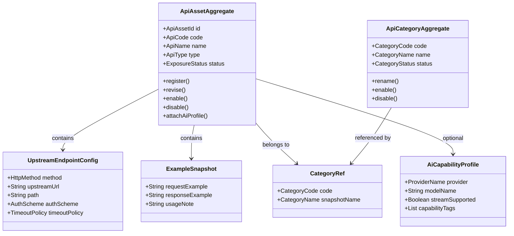
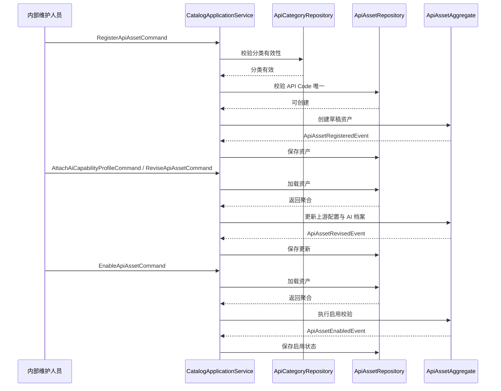

# Aether API Hub API Catalog 领域设计

API Catalog 是 Aether API Hub 第一期最适合先开发的第一个领域模块。原因很简单：它先定义“平台里有什么 API 资产、这些资产如何被分类、如何被启停、如何被识别为 AI 能力”，后续的 Hub 展示、统一鉴权、统一调用、调用日志都以它为前提。没有这个模块，其他模块只能围绕硬编码配置开发，后续返工成本会明显偏高。

## 1. 顶层共识与统一语言 (Ubiquitous Language)

### 1.1 模块职责边界 (Bounded Context)

- 包含：API 资产注册、编辑、分类、状态管理、上游接入配置、示例信息维护、AI 元数据标记。
- 包含：为 Hub 统一界面、Unified Access、Observability 提供统一的 API 资产主数据。
- 不包含：调用方身份、API Key 签发、统一调用转发、调用日志记录。
- 不包含：具体 API 入参与出参接口定义、数据库 DDL、底层网关实现。

一句话定义：

`API Catalog` 负责把零散 API 抽象成可管理、可发现、可配置、可演进的 API 资产，但不负责谁来调用、如何调用和调用结果如何记录。

### 1.2 核心业务词汇表 (Glossary)

- API 资产 (API Asset)：平台内可被管理和暴露的最小 API 业务单元，既可以是普通 API，也可以是 AI API。
- API 目录项 (Catalog Entry)：API 资产在 Hub 中的展示与管理载体，强调“可被发现”。
- API 编码 (API Code)：平台内唯一且稳定的 API 资产业务标识，用于配置、路由和跨模块引用。
- 分类 (Category)：用于组织 API 资产的业务归类方式，如“消息通知”“支付”“大模型”“图像生成”。
- 上游端点 (Upstream Endpoint)：API 资产真实连接的外部服务地址与请求方式配置。
- 暴露状态 (Exposure Status)：API 资产对平台的可见与可调用状态，第一期建议使用“草稿、启用、停用”。
- 鉴权方案 (Auth Scheme)：平台访问上游 API 时所需的认证方式描述，如 Header Token、Query Token、无鉴权等。
- 请求模板 (Request Template)：用于说明调用方法、基础参数和示例结构的配置描述，不是运行时强校验 DSL。
- 示例快照 (Example Snapshot)：供展示和理解使用的请求示例、响应示例和说明材料。
- AI 能力档案 (AI Capability Profile)：描述 AI API 的能力类型、供应商、模型标记、流式能力等扩展信息。
- 能力标签 (Capability Tag)：用于标记 API 可提供的能力关键词，如“chat”“embedding”“tts”“image-generation”。
- 流式能力 (Streaming Capability)：表示该 API 是否支持流式输出或实时返回。

## 2. 领域模型与聚合关系 (Domain Models & Aggregates)

简要说明：

- `ApiAssetAggregate` 是本模块的核心聚合根，负责保证单个 API 资产在注册、编辑、启停、AI 标记过程中的业务一致性。
- `ApiCategoryAggregate` 是轻量聚合根，负责维护分类本身的业务语义和启停状态。第一期如果希望进一步压缩范围，也可以先以轻量字典方式落地，但领域语义仍应保留。
- `UpstreamEndpointConfig`、`ExampleSnapshot`、`CategoryRef`、`AiCapabilityProfile` 更适合作为值对象或聚合内部对象，由 `ApiAssetAggregate` 统一维护。
- 第一阶段不要把“上游接入细节”设计成过度复杂的脚本化路由模型，保持配置驱动即可。

## 3. 核心业务约束 (Invariants & Business Rules)

- 唯一性约束：一个 `API Code` 在平台内必须全局唯一，且创建后不得随意变更。
- 可启用约束：只有配置完整的 API 资产才允许从“草稿”进入“启用”状态。
- 完整性约束：启用前必须具备基础名称、分类、请求方法、上游地址、鉴权方案等最小必要信息。
- 暴露约束：未启用的 API 资产不能进入 Hub 统一界面展示列表，也不能被 Unified Access 选作可调用目标。
- AI 类型约束：若 `ApiType = AI_API`，则必须具备 `AiCapabilityProfile`；若为普通 API，则 AI 扩展信息应为空或保持非激活状态。
- 分类引用约束：API 资产只能归属有效分类；被停用分类不得继续被新资产引用。
- 变更安全约束：已经启用的 API 资产在修改上游端点、鉴权方案、请求方式等关键配置后，必须重新通过启用前校验。
- 示例边界约束：请求示例和响应示例只用于展示与说明，不作为运行时业务判断依据。
- 演进约束：第一期一个 API 资产只维护一个主分类，避免过早引入复杂多维分类系统。
- 资产视角约束：AI API 必须被视为“能力资产”，而不只是一个待转发的 URL。

## 4. 核心用例与行为流转 (Core Behaviors)

### 4.1 用户故事 (User Stories)

- 用户故事 1：作为内部维护人员，我希望注册一个新的 API 资产，以便平台能够统一管理和后续接入该 API。
  - 验收标准 (AC)：当 `API Code` 重复时，系统必须拒绝创建并提示编码已存在。
  - 验收标准 (AC)：新建资产默认进入“草稿”状态，而不是直接启用。
- 用户故事 2：作为内部维护人员，我希望为一个 API 资产配置上游端点、鉴权方案和示例信息，以便后续展示与统一调用都使用同一份主数据。
  - 验收标准 (AC)：关键接入配置缺失时，资产不能被启用。
  - 验收标准 (AC)：示例信息可缺省，但缺省不影响草稿保存。
- 用户故事 3：作为内部维护人员，我希望将某个 API 资产标记为 AI API，并补充供应商、模型和流式能力信息，以便平台为后续 AI 能力演进预留结构。
  - 验收标准 (AC)：当资产类型为 AI API 时，缺失 AI 能力档案不得启用。
  - 验收标准 (AC)：AI 能力标签支持多值，但第一期不要求复杂标签治理。
- 用户故事 4：作为平台运营人员，我希望启用或停用某个 API 资产，以便控制其是否对外展示和可被统一接入层使用。
  - 验收标准 (AC)：停用后的 API 资产不再出现在可调用资产集合中。
  - 验收标准 (AC)：启用动作必须触发一次完整配置校验。
- 用户故事 5：作为内部开发者，我希望查看已启用 API 资产的列表和详情，以便快速判断可用能力并决定是否接入。
  - 验收标准 (AC)：列表只展示处于启用状态的资产。
  - 验收标准 (AC)：详情页能清晰区分普通 API 和 AI API。

### 4.2 核心领域事件/命令 (Commands & Events)

- 命令 (Command)：`RegisterApiAssetCommand`，注册 API 资产。
- 命令 (Command)：`ReviseApiAssetCommand`，编辑 API 资产基础配置。
- 命令 (Command)：`EnableApiAssetCommand`，启用 API 资产。
- 命令 (Command)：`DisableApiAssetCommand`，停用 API 资产。
- 命令 (Command)：`AttachAiCapabilityProfileCommand`，补充或更新 AI 能力档案。
- 命令 (Command)：`CreateApiCategoryCommand`，创建 API 分类。
- 事件 (Event)：`ApiAssetRegisteredEvent`，API 资产已注册。
- 事件 (Event)：`ApiAssetRevisedEvent`，API 资产配置已更新。
- 事件 (Event)：`ApiAssetEnabledEvent`，API 资产已启用。
- 事件 (Event)：`ApiAssetDisabledEvent`，API 资产已停用。
- 事件 (Event)：`AiCapabilityProfileAttachedEvent`，AI 能力档案已绑定。

### 4.2 核心业务流图 (Behavior Flow)

这个业务闭环说明了为什么 `API Catalog` 应该先做：

- 它先把 API 资产从“零散信息”变成“结构化主数据”。
- 它先定义哪些资产能被展示、能被调用、能被视为 AI 能力。
- 它一旦稳定，Hub 统一界面、Consumer/Auth、Unified Access、Observability 都能围绕同一份领域主数据继续展开。

如果跳过这个模块直接做统一调用层，后续几乎一定会出现配置回灌、领域边界混乱和路由规则返工的问题。