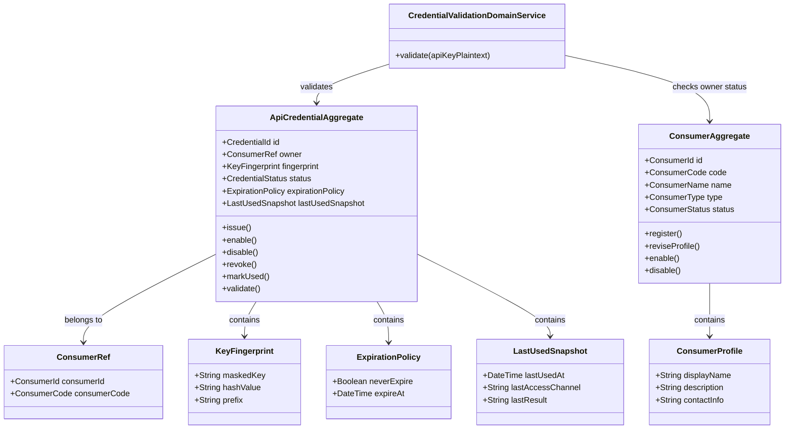
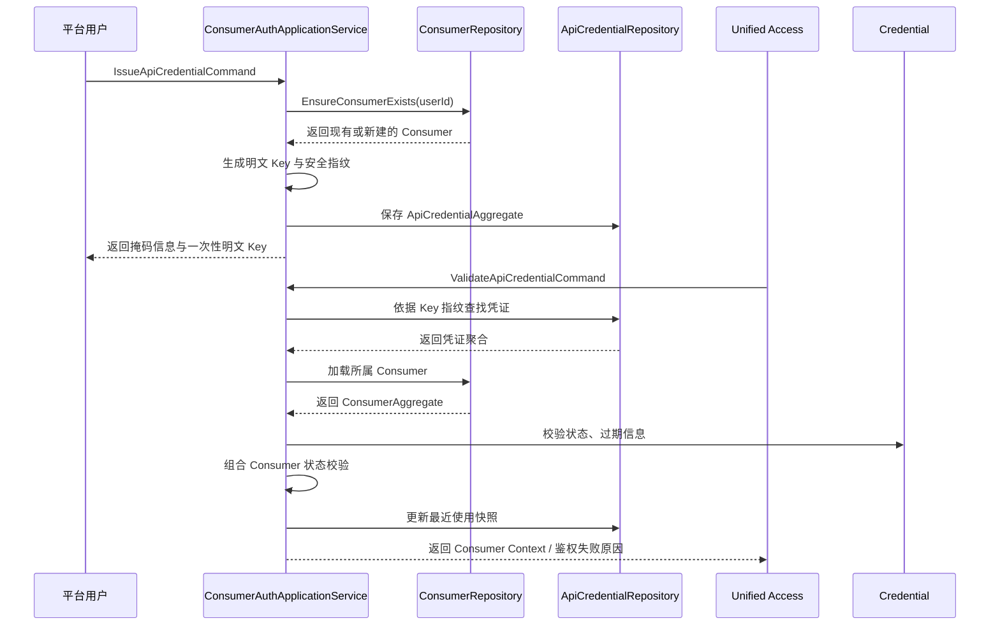

# Aether API Hub Consumer & Auth领域设计文档

在 `API Catalog / API 资源管理` 已经完成之后，Aether API Hub 下一步最适合拆分和落地的领域，不是继续围绕页面展示做拆分，而是优先完成 `Consumer & Auth / 开发者接入与凭证管理`。原因很直接：`API Catalog` 解决的是“平台里有什么 API 可以被管理和发现”，而 `Consumer & Auth` 解决的是“谁在调用、拿什么调用、平台如何识别调用方”。如果这一层没有先立住，后续的 `Unified Access` 无法形成稳定鉴权入口，`开发者控制台` 中的 API 调用与 API 日志也缺少明确的调用主体维度。

本领域因此承担一期主链路中的第二个关键锚点：在不引入完整用户系统、OAuth 和复杂权限体系的前提下，用足够克制但结构化的方式建立 `调用主体（Consumer）` 与 `访问凭证（API Key）` 的正式模型，为统一调用、日志关联和控制台查询提供稳定基础。

需要特别强调的是：第一期的 `Consumer` 是平台内部的调用身份抽象，而不是面向用户显式暴露的独立业务对象。对外业务表达应尽量保持简单，用户感知到的主要仍然是“我有一个账号，我可以生成和管理自己的 API Key”；至于 `Consumer` 的创建、绑定和存在方式，应由系统在内部自动完成。

## 1. 顶层共识与统一语言 (Ubiquitous Language)

### 1.1 模块职责边界 (Bounded Context)

- 包含：调用主体（Consumer）的注册、启停、标识维护。
- 包含：API Key 的生成、归属绑定、启停控制、过期控制、最近使用信息维护。
- 包含：统一调用入口所需的基础鉴权校验能力，即“通过凭证识别 Consumer 并判断是否允许继续调用”。
- 包含：为开发者控制台提供调用主体与凭证的基础查询视图所需的领域语义。
- 包含：在凭证签发过程中自动确保调用身份存在，并维护 `用户 -> Consumer -> API Key` 的内部映射关系。
- 不包含：完整用户账号系统、登录注册、组织体系、RBAC、多角色授权。
- 不包含：API 调用转发、上游路由、请求编排，这些属于 `Unified Access`。
- 不包含：调用日志落库、日志检索、监控告警，这些属于 `Observability`。
- 不包含：页面形态差异，不区分所谓“管理端”或独立后台；内部维护与开发者访问都只是同一产品界面的不同操作入口。
- 不包含：将 `Consumer` 作为一期对外显式操作对象单独展示或要求用户先手工注册。

一句话定义：

`Consumer & Auth` 负责回答“谁在调用、他持有什么凭证、该凭证此刻是否有效”，但不负责“请求如何转发”与“调用结果如何观测”。

### 1.2 核心业务词汇表 (Glossary)

- 调用主体（Consumer）：平台内部识别的接入主体，是 API Key 的归属对象与调用日志的主体维度。第一期默认可理解为“用户在调用链路中的内部身份映射”，后续也可以扩展为应用、项目或服务，但第一期不对外显式暴露为独立对象。
- 调用主体编码（Consumer Code）：调用主体在平台内稳定且唯一的业务标识，用于跨模块关联和控制台展示。
- 调用主体状态（Consumer Status）：表示 Consumer 当前是否允许持有和使用凭证，第一期建议使用“草稿、启用、停用”或“启用、停用”两态/三态模型。
- API Key：调用主体持有的访问凭证，用于通过统一入口发起 API 调用。
- 凭证指纹（Key Fingerprint）：平台内部用于识别和校验 API Key 的安全摘要信息，系统不长期保存明文 Key。
- 凭证状态（Credential Status）：表示某个 API Key 是否可继续用于调用，第一期建议至少支持“启用、停用、已吊销、已过期”。
- 明文一次性展示（One-time Secret Reveal）：API Key 在生成时仅展示一次明文，后续控制台不再返回完整明文。
- 最近使用快照（Last Used Snapshot）：记录某个凭证最近一次被成功或失败使用的时间与基础上下文，用于控制台展示和安全治理预留。
- 鉴权校验（Auth Validation）：统一入口接收到请求后，对 API Key、凭证状态、归属 Consumer 状态进行验证并返回调用主体上下文的过程。
- 调用主体上下文（Consumer Context）：鉴权通过后传递给后续模块的调用身份信息，至少包括 Consumer 标识、凭证标识和基础状态信息。
- 用户与 Consumer 映射（User-Consumer Mapping）：平台账号与内部调用身份之间的关联关系。第一期建议采用“一个用户默认对应一个 Consumer，一个 Consumer 可持有多个 API Key”的收敛模型。

## 2. 领域模型与聚合关系 (Domain Models & Aggregates)

简要说明：

- `ConsumerAggregate` 是调用主体的一致性边界，负责维护“这个调用主体是否存在、处于什么状态、是否还能继续作为平台接入主体”。在第一期中，它主要是平台内部对象，不作为用户必须理解和操作的显式概念。
- `ApiCredentialAggregate` 是访问凭证的一致性边界，负责维护“这个 Key 属于谁、当前是否可用、是否已过期、是否已吊销、最近使用情况如何”。
- 这里将 `Consumer` 与 `API Key` 拆成两个聚合根，而不是把所有凭证都塞进 `ConsumerAggregate` 内部，核心原因是凭证具有独立生命周期、高频状态变更与一对多关系。若把所有凭证都并入 Consumer 聚合，后续启停、吊销、更新最近使用时间时会导致聚合过重，也不利于并发和演进。
- 第一期建议采用“一个用户默认映射一个 Consumer、一个 Consumer 可签发多个 API Key”的模型。这样用户对外只需要理解 Key 管理，而系统内部仍然保留多 Key、日志归属和后续扩展能力。
- `ConsumerProfile`、`ConsumerRef`、`KeyFingerprint`、`ExpirationPolicy`、`LastUsedSnapshot` 更适合作为值对象或聚合内部对象，由对应聚合根统一维护。
- `CredentialValidationDomainService` 作为领域服务存在，是因为“明文 API Key 输入 -> 指纹识别 -> 凭证状态校验 -> Consumer 状态校验 -> 返回身份上下文”这一过程天然跨越凭证与调用主体两个聚合，不应硬塞进任一单一实体。
- 第一阶段不在这个领域中建模“用户账号”“管理员”“权限角色”。这不是缺失，而是有意收敛：当前系统只有 API 市场和开发者控制台，同一界面承担内部维护与开发者使用，不需要为了“像权限系统”而提前制造一整套身份域。`Consumer` 存在的目的，是稳定调用身份，而不是增加一层用户必须手动操作的业务流程。

## 3. 核心业务约束 (Invariants & Business Rules)

- 唯一性约束：`Consumer Code` 在平台内必须唯一，创建后不应随意修改。
- 归属约束：每个 `API Key` 必须且只能归属于一个 `Consumer`，归属关系建立后不可变更；如确需迁移，应通过旧 Key 吊销、新 Key 重发完成。
- 前置约束：只有合法存在且处于可用状态的 `Consumer` 才允许签发新的 API Key。
- 自动创建约束：第一期不要求用户显式注册 `Consumer`；当用户首次创建 API Key 或首次开通开发者调用能力时，系统应自动确保对应 Consumer 已创建并完成绑定。
- 安全约束：API Key 明文只允许在签发当次展示一次，系统内部只保存其安全摘要、掩码信息与识别前缀，不长期保存完整明文。
- 有效性约束：处于停用、吊销、过期状态的 API Key 必须鉴权失败，不得继续进入统一调用链路。
- 主体联动约束：即使 API Key 本身状态正常，只要其所属 `Consumer` 已停用，鉴权也必须失败。
- 生命周期约束：停用是可恢复动作，吊销是不可恢复动作；若第一期需要控制复杂度，可在实现上先只完整支持“启用 / 停用”，但领域语义应明确保留“吊销”概念。
- 最近使用约束：`LastUsedSnapshot` 属于运维辅助信息，不参与授权决策本身；它可以为空，但一旦发生调用应按约定更新。
- 模式约束：第一期只支持 `API Key` 鉴权模式，不在本领域内引入 OAuth、Token Exchange、细粒度 Scope 和多角色授权。
- 边界约束：Controller、Mapper、第三方适配器中不允许直接写凭证校验业务规则；鉴权判定必须通过本领域的应用服务和领域对象完成。
- 对外简化约束：第一期对外不显式暴露 `Register Consumer`、`Enable Consumer` 等概念；用户主要感知并操作的是 API Key，Consumer 属于内部稳定结构。

## 4. 核心用例与行为流转 (Core Behaviors)

### 4.1 用户故事 (User Stories)

- 用户故事 1：作为平台用户，我希望可以直接生成 API Key，而不是先理解和注册一个额外的 `Consumer` 概念，这样平台对外体验才足够简单。
  - 验收标准（AC）：用户发起 API Key 创建动作时，系统应自动确保对应 Consumer 已存在。
  - 验收标准（AC）：用户侧主要感知的是 API Key 的生成与管理，而不是单独管理 Consumer。

- 用户故事 2：作为平台用户，我希望能够创建、查看掩码、停用、恢复或销毁自己的 API Key，以便安全地使用平台 API。
  - 验收标准（AC）：签发成功时仅返回一次明文 Key，后续查询只展示掩码值。
  - 验收标准（AC）：一个 Consumer 应支持持有多个 API Key，以支撑多环境、多用途或后续轮换场景。

- 用户故事 3：作为统一接入层，我希望在收到请求时快速完成 API Key 校验并拿到调用主体上下文，以便后续执行路由、转发和日志记录。
  - 验收标准（AC）：鉴权成功后应返回明确的 Consumer 与 Credential 标识，而不是只返回一个“true / false”。
  - 验收标准（AC）：鉴权失败时应区分“凭证不存在”“凭证已停用/吊销/过期”“调用主体不可用”等原因类别。

- 用户故事 4：作为开发者控制台用户，我希望看到自己当前持有的 API Key 基础信息和最近使用情况，以便确认凭证状态和使用痕迹。
  - 验收标准（AC）：控制台查询结果不返回 API Key 完整明文。
  - 验收标准（AC）：控制台至少能展示凭证状态、创建时间、最近使用时间和基础归属信息。

- 用户故事 5：作为平台，我希望即使对外不暴露 `Consumer`，内部仍然保留稳定的调用身份结构，以便日志、统计、限额和后续能力演进不需要重构底层模型。
  - 验收标准（AC）：每个 API Key 都必须可以追溯到唯一 Consumer。
  - 验收标准（AC）：调用日志应能够稳定关联到 Consumer，而不依赖页面层或临时会话信息。

### 4.2 核心领域事件/命令 (Commands & Events)

- 命令（Command）：`EnsureConsumerExistsCommand`，在签发凭证前自动确保用户对应的调用主体存在。该命令属于系统内部能力，不应作为一期对外显式业务动作。
- 命令（Command）：`ReviseConsumerProfileCommand`，更新调用主体的内部资料或展示快照，主要服务于控制台和治理能力预留。
- 命令（Command）：`IssueApiCredentialCommand`，为指定 Consumer 签发 API Key。
- 命令（Command）：`EnableApiCredentialCommand`，恢复某个已停用凭证。
- 命令（Command）：`DisableApiCredentialCommand`，停用某个凭证。
- 命令（Command）：`RevokeApiCredentialCommand`，吊销某个凭证。
- 命令（Command）：`ValidateApiCredentialCommand`，对传入 API Key 进行鉴权校验并返回调用主体上下文。
- 事件（Event）：`ConsumerEnsuredEvent`，调用主体已存在或已被自动创建。
- 事件（Event）：`ConsumerProfileRevisedEvent`，调用主体资料已更新。
- 事件（Event）：`ApiCredentialIssuedEvent`，新凭证已签发。
- 事件（Event）：`ApiCredentialDisabledEvent`，凭证已停用。
- 事件（Event）：`ApiCredentialRevokedEvent`，凭证已吊销。
- 事件（Event）：`ApiCredentialValidatedEvent`，凭证校验成功。

### 4.3 核心业务流图 (Behavior Flow)

这个业务闭环说明了为什么 `Consumer & Auth` 应该成为 `API Catalog` 之后的下一个领域：

- `API Catalog` 定义了“可被接入和调用的 API 资产”。
- `Consumer & Auth` 定义了“由谁来调用这些 API 资产”。
- 有了调用主体和凭证模型，`Unified Access` 才能拥有稳定入口，`Observability` 才能把日志与具体 Consumer 关联起来，开发者控制台中的“API 调用 / API 日志”也才有真正可查询的主体维度。
- 同时，因为 `Consumer` 被收敛为平台内部结构，用户对外不需要多理解一层额外概念，产品体验仍然可以保持为“登录、生成 API Key、使用 API”。

如果跳过这一层，直接去做统一接入或日志模块，短期虽然也能跑通“请求转发”，但很快就会遇到三个明显问题：

- 无法稳定识别调用方，只能退化成全局共享 Key 或匿名调用。
- 调用日志缺少主体归属，开发者控制台难以成立。
- 后续再补 Consumer、API Key、控制台能力时，统一接入和日志模型都需要返工。

因此，从一期价值和后续演进成本看，`Consumer & Auth` 是当前最合理的下一个领域拆分。
