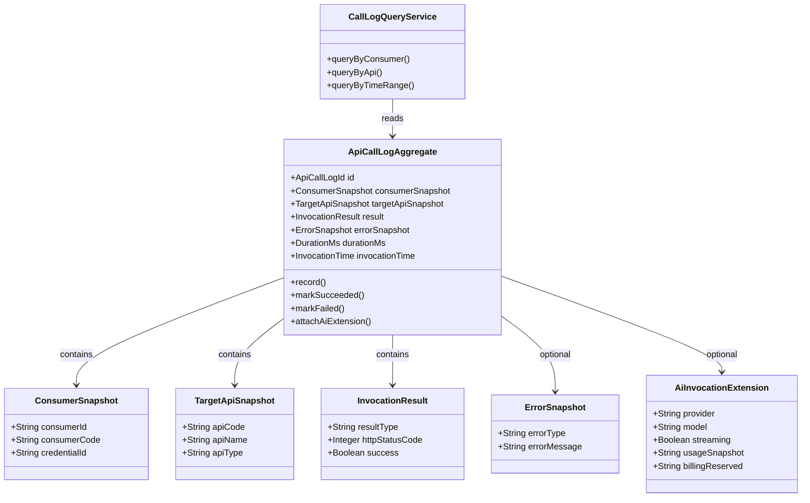
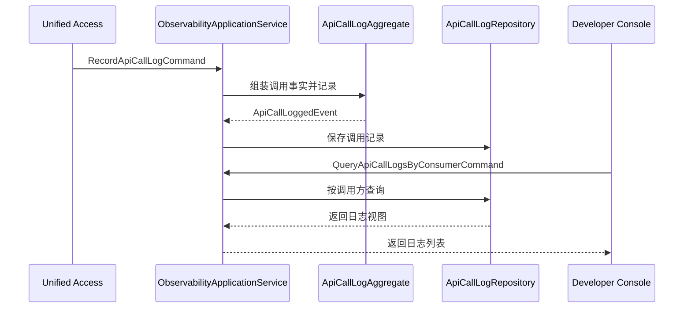

# Aether API Hub Observability领域设计文档

在 `API Catalog / API 资源管理`、`Consumer & Auth / 开发者接入与凭证管理` 已经完成，且 `Unified Access / 轻量统一接入层` 已进入开发之后，Aether API Hub 第一期剩下最必要、最适合继续拆分的后端领域，应当是 `Observability / 调用日志与基础观测`。原因很直接：第一期目标不是把平台做成完整监控系统，而是至少做到“每一次统一调用都可被记录、可被归因、可被查询”，从而真正支撑开发者控制台中的 API 调用与 API 日志视图。

从主链路视角看，`Observability` 承接的是“调用已经发生之后，平台如何把这次调用转化为稳定的业务记录”。`API Catalog` 提供“调用的目标是谁”，`Consumer & Auth` 提供“调用的主体是谁”，`Unified Access` 提供“调用是如何执行并得出结果的”，而 `Observability` 则负责把这些事实沉淀下来，变成后续控制台、排障、计费预留和调用分析都能消费的基础数据。

因此，若问第一期关键领域是否都已经做完，我的判断是：

- 核心“主链路建模”已经接近完成
- 剩下最必要的领域，不是再拆一个新的身份域或页面域，而是把 `Observability` 单独立起来

也就是说，第一期剩余最必要的后端领域，本质上就是：

**“调用日志与基础观测领域”**

## 1. 顶层共识与统一语言 (Ubiquitous Language)

### 1.1 模块职责边界 (Bounded Context)

- 包含：记录统一调用过程中产生的调用事实。
- 包含：沉淀调用主体、目标 API、请求时间、耗时、状态码、错误结果等基础观测数据。
- 包含：支持按调用方、按 API、按时间范围的基础日志查询能力。
- 包含：为开发者控制台提供“API 调用 / API 日志”所需的最小读模型语义。
- 包含：为后续积分扣减、AI 计费、限额分析、安全治理预留必要字段。
- 包含：在 AI API 场景下预留供应商、模型、流式标记、用量统计等扩展观测位。
- 不包含：调用入口接收、目标 API 匹配、请求转发，这些属于 `Unified Access`。
- 不包含：API Key 生成、Consumer 建模、凭证校验，这些属于 `Consumer & Auth`。
- 不包含：API 资源配置和 AI 元数据录入，这些属于 `API Catalog`。
- 不包含：完整监控平台能力，如指标系统、告警系统、分布式链路平台、仪表盘体系。
- 不包含：完整计费、积分扣减、风控处置，只负责提供可被消费的事实数据。

一句话定义：

`Observability` 负责把一次已经发生的 API 调用，沉淀为“可归因、可查询、可扩展”的调用记录，但不负责发起调用、鉴权或分析决策。

### 1.2 核心业务词汇表 (Glossary)

- 调用记录（API Call Log）：一次统一调用在平台内形成的正式记录，是本领域最核心的数据对象。
- 调用事实（Invocation Fact）：从调用链中抽取出来的基础事实，例如是谁调了哪个 API、何时调用、是否成功、耗时多久。
- 调用主体快照（Consumer Snapshot）：记录日志时从 `Consumer & Auth` 获取到的最小主体上下文快照。
- 目标 API 快照（Target Api Snapshot）：记录日志时从 `Unified Access` / `API Catalog` 获取到的目标 API 关键识别信息。
- 调用结果分类（Invocation Result Type）：对一次调用结果的统一归因，例如成功、鉴权失败、目标不可用、上游失败、超时失败。
- 错误快照（Error Snapshot）：调用失败时记录的错误类型、错误说明和必要上下文。
- 耗时（Duration Ms）：一次调用从平台接收到完成结果的耗时。
- 调用时间（Invocation Time）：一次调用发生的时间点。
- AI 扩展观测位（AI Observability Extension）：AI API 调用需要额外记录的扩展信息，如供应商、模型、流式标记、用量与成本预留。
- 日志查询视图（Log Query View）：面向开发者控制台的日志查询结果形态，不等于底层日志存储结构本身。

## 2. 领域模型与聚合关系 (Domain Models & Aggregates)

简要说明：

- `ApiCallLogAggregate` 是本领域的核心聚合根。它不是为了表达“复杂状态机”，而是为了确保“一次调用记录必须具备哪些最小事实、哪些事实是成功场景必填、哪些事实是失败场景必填、哪些事实只在 AI 场景出现”。
- 之所以不把日志设计成一个简单 Mapper 直写表，是因为一期虽然强调实用，但日志记录已经是开发者控制台、后续计费和分析的基础。如果没有清晰的领域语义，后续很容易变成“字段越堆越多、含义越来越混乱”的技术日志表。
- `ConsumerSnapshot`、`TargetApiSnapshot`、`InvocationResult`、`ErrorSnapshot`、`AiInvocationExtension` 都更适合作为值对象或聚合内部对象。
- `CallLogQueryService` 不属于聚合内部，而是本领域的读模型服务，负责承接开发者控制台中的最小查询需求。
- 这里同样采用“工程实用版 DDD”原则：聚合负责事实一致性，查询服务负责读视图，不为了像日志平台而额外制造复杂索引领域或监控策略对象。

## 3. 核心业务约束 (Invariants & Business Rules)

- 最小事实约束：每条调用记录至少必须关联调用主体、目标 API、调用结果、调用时间和耗时。
- 归因约束：调用记录必须能稳定归因到一个 Consumer 和一个目标 API，而不是匿名文本日志。
- 单次调用约束：一次统一调用对应一条正式调用记录；一期不在本领域内拆分子步骤级链路明细。
- 成功记录约束：成功调用必须记录成功结果类型、HTTP 状态码和耗时。
- 失败记录约束：失败调用必须记录失败结果分类，并至少保留一份错误快照。
- 错误分类约束：日志中的失败类型必须与 `Unified Access` 输出的调用结果分类保持一致，不能在日志层重新发明第二套分类。
- AI 扩展约束：若目标 API 属于 AI API，则日志记录必须允许附带 AI 扩展观测位；若是普通 API，则 AI 扩展字段保持为空或非激活状态。
- 查询边界约束：一期日志查询以“日志可查”为目标，不在本领域内扩展复杂搜索、全文检索和高阶分析。
- 敏感信息约束：日志记录不应长期保存不必要的敏感凭证明文或过度的原始业务载荷；只保留对排障和后续治理真正必要的字段。
- 平台定位约束：本领域是一套“业务观测记录模型”，不是一个完整 APM/监控平台。

## 4. 核心用例与行为流转 (Core Behaviors)

### 4.1 用户故事 (User Stories)

- 用户故事 1：作为平台，我希望每次统一调用结束后都能形成一条正式调用记录，这样后续控制台和排障才有稳定依据。
  - 验收标准（AC）：无论调用成功还是失败，都必须产生正式调用记录。
  - 验收标准（AC）：记录中必须包含调用主体、目标 API、调用结果、时间与耗时。

- 用户故事 2：作为开发者控制台用户，我希望按自己的调用身份查询 API 调用和 API 日志，这样我能知道自己最近调了什么、是否成功。
  - 验收标准（AC）：系统至少支持按调用方查询日志。
  - 验收标准（AC）：查询结果应能展示目标 API、结果类型、时间和耗时。

- 用户故事 3：作为平台，我希望统一接入层给出的失败分类能被日志直接复用，而不是在日志层重新解释一遍，这样后续分析才不会混乱。
  - 验收标准（AC）：日志中的结果类型必须与调用执行结果保持一致。
  - 验收标准（AC）：失败日志必须至少带有一份错误快照。

- 用户故事 4：作为平台，我希望 AI API 的调用记录比普通 API 多保留一层 AI 扩展信息，这样后续计费和 AI 分析才有基础。
  - 验收标准（AC）：AI API 日志允许记录供应商、模型、流式标记等扩展字段。
  - 验收标准（AC）：普通 API 日志不强制填写这些 AI 扩展字段。

- 用户故事 5：作为平台，我希望日志领域先做到“可查、可归因、可扩展”，而不是一期就演化成复杂监控平台，这样交付边界才可控。
  - 验收标准（AC）：一期不要求告警、监控仪表盘、链路追踪平台。
  - 验收标准（AC）：一期重点只放在调用记录落库与基础查询。

### 4.2 核心领域事件/命令 (Commands & Events)

- 命令（Command）：`RecordApiCallLogCommand`，记录一次调用结果。
- 命令（Command）：`QueryApiCallLogsByConsumerCommand`，按调用方查询日志。
- 命令（Command）：`QueryApiCallLogsByApiCommand`，按目标 API 查询日志。
- 命令（Command）：`QueryApiCallLogsByTimeRangeCommand`，按时间范围查询日志。
- 事件（Event）：`ApiCallLoggedEvent`，调用记录已生成。
- 事件（Event）：`ApiCallSucceededLoggedEvent`，成功调用已记录。
- 事件（Event）：`ApiCallFailedLoggedEvent`，失败调用已记录。
- 事件（Event）：`AiInvocationExtensionAttachedEvent`，AI 扩展观测信息已挂载。

### 4.3 核心业务流图 (Behavior Flow)

这个业务闭环说明了为什么 `Observability` 是当前 Unified Access 之后第一期最必要的下一个领域：

- `Unified Access` 已经让调用真正发生
- `Observability` 负责让调用结果真正“留下痕迹”
- 开发者控制台中的“API 调用 / API 日志”能力，正是建立在这层之上

如果不把 `Observability` 单独立起来，会很快出现三个问题：

- 调用日志只能散落在统一接入代码里，缺少稳定领域边界
- 控制台查询模型会和执行模型混在一起，后续扩展困难
- 后面要做计费、分析、排障时，很难确定哪一份数据才是正式调用事实

因此，从第一期 MVP 的必要性来看，我的判断是：

- 关键领域并不是都做完了
- `Observability / 调用日志与基础观测` 仍然是第一期剩余的必要领域

最后补充一个我认为值得你后面继续拍板的点：

- 一期日志到底记录到什么粒度最合适

我当前倾向于：

- 记录“统一调用事实”
- 不记录过重的原始请求/响应全文
- 保持“足够排障、足够控制台展示、足够后续扩展”的最小粒度

这样更符合一期节奏，也更稳。
