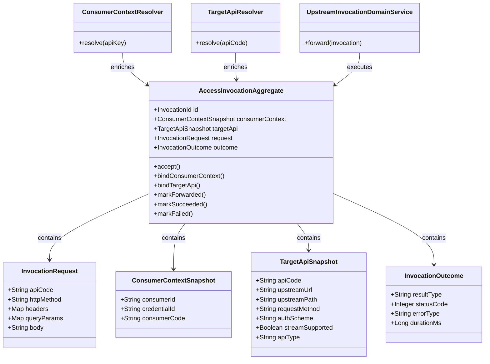
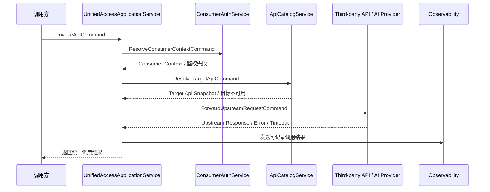

# Aether API Hub Unified Access领域设计文档

在 `API Catalog / API 资源管理` 与 `Consumer & Auth / 开发者接入与凭证管理` 已经完成之后，Aether API Hub 下一步最适合拆分和落地的领域，应当是 `Unified Access / 轻量统一接入层`。原因很明确：`API Catalog` 解决了“平台里有什么 API 可以被接入和发现”，`Consumer & Auth` 解决了“谁在调用、拿什么调用”，而 `Unified Access` 则真正回答“请求如何进入平台、如何匹配目标 API、如何转发到上游、如何返回调用结果”。

从一期主链路看，这个领域是整条调用链的中心环节。没有 `Unified Access`，平台即使已经拥有 API 资源和 API Key，也仍然只是“可管理、可识别”，却还不是“可统一调用”的 Hub。与此同时，`Observability` 要记录的调用事实、状态分类和错误结果，也必须建立在 `Unified Access` 已经定义好调用生命周期的前提上，因此它更适合作为 `Unified Access` 之后的下一个领域，而不是反过来先行。

本领域的目标不是重做一个完整 API Gateway，而是在 `Hub-first, Gateway-light` 的约束下，建立一套足够清晰、足够稳定、足够可扩展的统一调用模型，让一期可以打通“凭证校验 -> API 识别 -> 请求转发 -> 结果返回 -> 日志可记录”的主链路。

## 1. 顶层共识与统一语言 (Ubiquitous Language)

### 1.1 模块职责边界 (Bounded Context)

- 包含：统一调用入口接收请求。
- 包含：基于 API 标识匹配目标 API 资产与上游配置。
- 包含：在调用前接入 `Consumer & Auth` 进行凭证校验并获取调用主体上下文。
- 包含：将请求按“轻量映射 / 尽量透传”的原则转发至第三方 API 或 AI Provider。
- 包含：统一处理超时、调用失败、基础错误分类和响应回传。
- 包含：为 `Observability` 提供可记录的调用结果与调用上下文。
- 包含：为 AI API 保留流式透传和 AI 扩展字段的承接边界。
- 包含：在成功调用场景下尽量保留上游响应语义，而不是将上游业务响应重新包装为平台内部管理接口格式。
- 不包含：API 资源维护、分类管理、AI 元数据录入，这些属于 `API Catalog`。
- 不包含：API Key 生成、Consumer 绑定、凭证启停，这些属于 `Consumer & Auth`。
- 不包含：调用日志查询、分析看板、告警与监控治理，这些属于 `Observability`。
- 不包含：复杂网关能力，如限流、配额、熔断、重试编排、智能路由、多上游负载均衡。
- 不包含：完整 AI Gateway 能力，如多模型路由、Fallback、统一 Token 计费。

一句话定义：

`Unified Access` 负责把“一个已被识别的调用请求”稳定地送到“一个已被配置的目标 API”，并把调用结果带回来，但不负责资源管理、身份签发和日志分析。

### 1.2 核心业务词汇表 (Glossary)

- 统一调用入口（Unified Entry）：平台对外暴露的统一 API 调用入口，是所有调用链的起点。
- 访问调用（Access Invocation）：一次从平台入口发起、经由鉴权、匹配、转发并返回结果的完整调用过程。
- 目标 API（Target API）：本次调用最终命中的 API 资产，由 `API Catalog` 中的启用资产提供配置来源。
- 目标快照（Target Api Snapshot）：调用时刻读取到的 API 关键配置快照，如 API 编码、请求方法、上游地址、鉴权方案、AI 能力标记等。
- 调用主体上下文（Consumer Context）：由 `Consumer & Auth` 返回的调用身份信息，至少包含 Consumer 与 Credential 的基础标识。
- 上游请求（Upstream Request）：平台经过最小必要处理后发往第三方 API / AI Provider 的真实请求。
- 上游响应（Upstream Response）：第三方 API / AI Provider 返回给平台的结果。
- 轻量透传（Gateway-light Pass-through）：除必要鉴权、目标匹配和基础错误处理外，不对请求和响应做复杂网关治理。
- 调用结果（Invocation Outcome）：一次调用的最终归因结果，至少区分成功、鉴权失败、目标不可用、上游失败、超时失败。
- 流式透传（Streaming Pass-through）：当目标 API 具备流式能力时，统一接入层尽量保留流式输出特征，而不是强制收敛成一次性完整响应。
- 平台管理接口返回（Platform Management Response）：Aether API Hub 内部业务管理类接口使用的统一返回结构，如 `TML-SDK Result`。
- 上游业务响应（Upstream Business Response）：第三方 API / AI Provider 对实际业务调用返回的状态码、响应头与响应体，默认应由统一接入层尽量保留其原始语义。

## 2. 领域模型与聚合关系 (Domain Models & Aggregates)

简要说明：

- `AccessInvocationAggregate` 是本领域最核心的调用一致性边界，但它是一个“运行时聚合”，而不是一个需要长期持久化保存的传统业务主数据聚合。它承载的是“一次调用在统一接入层内部必须遵守的生命周期约束”。
- 之所以不把这个领域设计成一个重持久化的“路由配置聚合”，是因为目标 API 的主数据已经由 `API Catalog` 拥有，调用身份已经由 `Consumer & Auth` 拥有，`Unified Access` 的本质更偏向“运行时编排与约束收敛”，而不是再复制一套主数据。
- `InvocationRequest`、`ConsumerContextSnapshot`、`TargetApiSnapshot`、`InvocationOutcome` 更适合作为聚合内部值对象或快照对象，由 `AccessInvocationAggregate` 统一维护。
- `ConsumerContextResolver` 负责衔接 `Consumer & Auth`，`TargetApiResolver` 负责衔接 `API Catalog`，`UpstreamInvocationDomainService` 负责承接实际转发行为。这样可以保持“跨领域取数和调用由服务协调，调用生命周期一致性由聚合约束”。
- 这里有意识地不把“复杂网关策略”建模成一大批策略对象和规则树。一期更合理的做法是：保留清晰模型和边界，但让实现保持轻量，否则很容易为了像网关而制造大量空壳结构。

## 3. 核心业务约束 (Invariants & Business Rules)

- 前置校验约束：统一调用请求在进入上游之前，必须先完成凭证校验并拿到 `Consumer Context`。
- 目标匹配约束：只有处于启用状态且具备完整接入配置的 API 资产，才允许成为统一接入目标。
- 单目标约束：一次 `Access Invocation` 在一期内只允许命中一个目标 API，不做多目标路由或回退。
- 透传优先约束：统一接入层默认以“尽量透传”为原则，只做最小必要的参数与头信息处理，不在一期引入复杂编排。
- 错误分类约束：调用失败至少需要区分鉴权失败、目标不存在/不可用、上游失败、超时失败这几类结果，而不是统一折叠成单一失败。
- 配置依赖约束：`Unified Access` 不拥有 API 配置主数据，只消费 `API Catalog` 提供的已启用资产快照。
- 身份依赖约束：`Unified Access` 不生成也不修改 Consumer / Credential，只消费 `Consumer & Auth` 返回的调用主体上下文。
- 流式保留约束：若目标 API 被标记为支持流式，则统一接入层应优先保留流式响应能力，而不是在领域层强制改写为普通响应。
- 响应边界约束：统一接入层可以做统一错误分类与基础封装，但不应为了统一而抹平所有上游语义；尤其 AI API 的响应结构不宜在一期做重变换。
- 返回格式约束：`TML-SDK Result` 只适用于平台内部业务管理接口，不适用于统一接入成功场景；统一接入成功时应优先保留上游状态码、响应头和响应体语义。
- 可观测预留约束：统一接入层必须产出足够的调用事实，使 `Observability` 能在后续记录 API、Consumer、状态码、耗时和错误结果。

## 4. 核心用例与行为流转 (Core Behaviors)

### 4.1 用户故事 (User Stories)

- 用户故事 1：作为调用方，我希望通过统一入口调用某个已接入 API，而不是分别记住不同上游地址和调用方式。
  - 验收标准（AC）：请求进入统一入口后，系统必须能够根据 API 标识找到唯一目标 API。
  - 验收标准（AC）：若目标 API 不存在或不可用，系统必须明确返回失败。

- 用户故事 2：作为平台，我希望每次统一调用都先完成凭证校验并绑定调用主体上下文，这样后续转发和日志记录才有稳定主体。
  - 验收标准（AC）：未通过凭证校验的请求不得进入上游调用环节。
  - 验收标准（AC）：校验通过后，调用链中必须携带 `Consumer Context`。

- 用户故事 3：作为平台，我希望统一接入层对上游请求做最小必要处理，而不是在一期引入复杂网关规则，这样能更快打通主链路。
  - 验收标准（AC）：一期调用行为以“透传 + 必要映射”为主。
  - 验收标准（AC）：不在本领域中引入复杂限流、熔断、重试编排逻辑。

- 用户故事 4：作为平台，我希望能清晰区分本次调用是鉴权失败、目标匹配失败、上游失败还是超时失败，这样后续日志和控制台才有意义。
  - 验收标准（AC）：调用结果至少应输出统一的结果分类。
  - 验收标准（AC）：不同失败类型必须可被后续 `Observability` 消费。

- 用户故事 5：作为调用方，我希望上游业务接口成功时，平台尽量返回上游原始响应，而不是统一包装成平台内部管理接口格式。
  - 验收标准（AC）：统一接入成功时不使用 `TML-SDK Result` 包装业务响应。
  - 验收标准（AC）：统一接入层优先保留上游状态码、响应体和关键响应头语义。

- 用户故事 6：作为 AI API 调用方，我希望当目标 API 支持流式时，统一接入层尽量保留这种调用方式，而不是提前把它抹平成普通响应。
  - 验收标准（AC）：对于支持流式的 AI API，统一接入层至少要保留流式透传边界。
  - 验收标准（AC）：一期不要求完整 AI Gateway，只要求流式能力不被领域模型阻断。

### 4.2 核心领域事件/命令 (Commands & Events)

- 命令（Command）：`InvokeApiCommand`，发起一次统一调用请求。
- 命令（Command）：`ResolveConsumerContextCommand`，校验凭证并解析调用主体上下文。
- 命令（Command）：`ResolveTargetApiCommand`，根据 API 标识解析目标 API 配置快照。
- 命令（Command）：`ForwardUpstreamRequestCommand`，向目标上游发起真实调用。
- 事件（Event）：`AccessInvocationAcceptedEvent`，调用请求已被统一入口接收。
- 事件（Event）：`ConsumerContextResolvedEvent`，调用身份上下文已完成解析。
- 事件（Event）：`TargetApiResolvedEvent`，目标 API 已匹配成功。
- 事件（Event）：`AccessInvocationForwardedEvent`，请求已转发至上游。
- 事件（Event）：`AccessInvocationSucceededEvent`，调用成功完成。
- 事件（Event）：`AccessInvocationFailedEvent`，调用失败并完成分类。

### 4.3 核心业务流图 (Behavior Flow)

这个业务闭环说明了为什么 `Unified Access` 应该成为 `Consumer & Auth` 之后的下一个领域：

- `API Catalog` 已经定义了“平台里有哪些 API 可以被接入”。
- `Consumer & Auth` 已经定义了“谁可以拿什么凭证来调用”。
- `Unified Access` 才真正把“资源”和“身份”组合成“可执行调用”。
- `Observability` 记录的是调用事实，而调用事实必须先由 `Unified Access` 生成，因此日志领域更适合作为它的下游领域。

如果跳过 `Unified Access` 先去做 `Observability`，会很快遇到三个问题：

- 日志模型没有稳定的调用生命周期可依附。
- 错误分类会被分散在控制器、适配器和调用代码中，后面难以统一。
- 调用日志虽然可以落库，但“统一调用”这一期最核心价值仍然没有真正建立起来。

因此，从主链路优先级、领域边界清晰度和后续日志能力的可演进性来看，`Unified Access` 是当前最合理的下一个领域拆分。

### 4.4 统一接入运行流程说明 (Runtime Flow)

从运行时视角看，一次统一调用在一期内建议按下面的顺序执行：

1. 调用方访问统一入口，例如 `{aetherApiBaseUrl}/{apiCode}` 或等价的统一路径。
2. 统一接入层先从请求中提取 API Key，并调用 `Consumer & Auth` 完成凭证校验。
3. 若鉴权通过，统一接入层拿到 `Consumer Context`，作为本次调用的身份上下文。
4. 统一接入层根据访问标识匹配 `API Catalog` 中的目标 API 资产，并读取调用时刻的关键配置快照。
5. 统一接入层按“最小必要处理”原则构造上游请求：
   - 透传 query 参数
   - 透传 body
   - 透传允许继续向上传递的请求头
   - 注入平台到上游所需的鉴权信息
   - 清理不应暴露给上游的内部头信息
6. 统一接入层发起真实上游调用，并接收上游成功、失败或超时结果。
7. 统一接入层形成统一的调用结果分类，并把可观测信息发送给 `Observability`。
8. 若上游调用成功，则优先按原始语义将上游状态码、响应头、响应体返回给调用方；若平台前置失败或转发失败，则返回平台侧错误响应。

这个流程也进一步说明了本领域的技术定位：

- 它是“统一调用调度层”，不是“平台业务接口包装层”。
- 它是“轻量接入转发层”，不是“全功能网关治理层”。
- 它会统一失败分类，但不会在成功场景下重写上游业务语义。

最后补充一个已经明确的设计结论：

- 管理类 Controller 返回 `TML-SDK Result` 是明确约束，继续保持即可。
- `Unified Access` 不应在成功调用场景下使用 `TML-SDK Result` 包装上游业务响应。
- 换句话说，`TML-SDK Result` 属于平台自身业务接口规范，而不是统一调用入口的成功返回规范。
