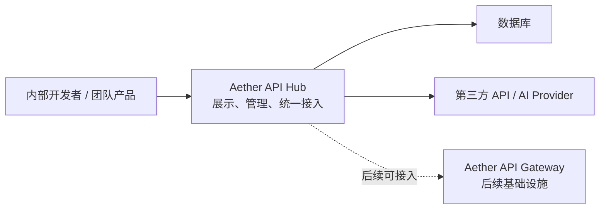
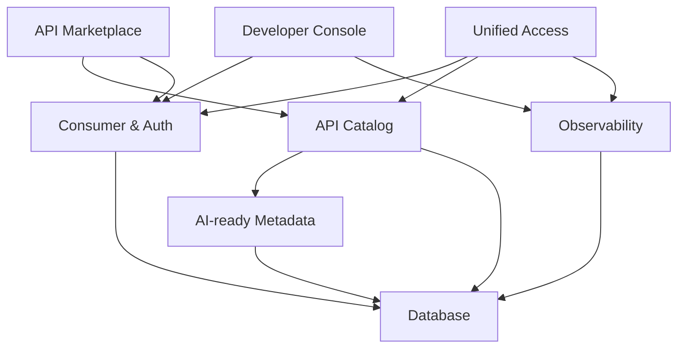
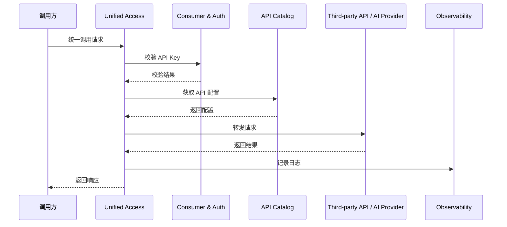
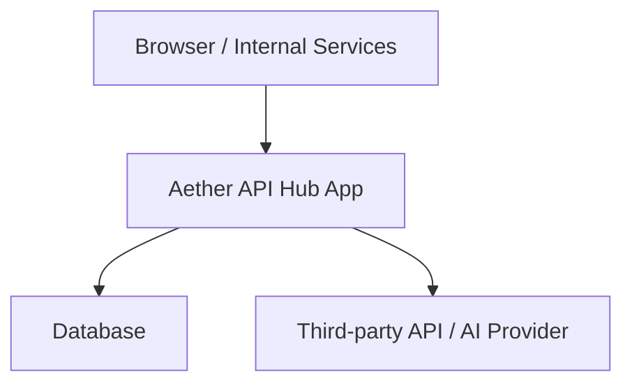

# Aether API Hub架构设计文档

## 1. 架构引言与业务上下文 (Introduction & Context)

### 1.1 系统上下文 (System Context)

Aether API Hub 是 AetherAPI 在第一期重点建设的核心系统，目标是为团队内部和后续外部生态提供统一的 API 聚合、展示、接入与调用入口。它面向的不是底层高性能网关能力本身，而是 API 资源的组织、管理、接入体验和调用可观测能力。

在第一期范围内，Aether API Hub 的定位明确为：

- 一个 `AI-ready API Hub MVP`
- 一个坚持 `Hub-first, Gateway-light` 的平台型应用
- 一个优先支撑 API 聚合管理与统一接入的业务系统

本文档只讨论 `Aether API Hub` 的架构设计，不展开 `Aether API Gateway` 的架构设计。对于第一期而言，Aether API Gateway 可以被视为后续可接入的基础设施能力，当前阶段由 Hub 内部的轻量统一接入层承担最小可用能力。

Aether API Hub 在系统上下文中的位置如下：

- 上游依赖：
  - 第三方 API 服务
  - AI Provider API
  - 后续可接入的独立 API Gateway
- 本系统：
  - API 资源管理
  - Hub 展示与浏览
  - 调用方接入与凭证管理
  - 轻量统一接入层
  - 调用日志与基础观测
  - AI-ready 元数据与扩展位
- 下游使用方：
  - 内部开发者
  - 团队产品服务
  - 后续外部开发者或 API 使用者

下面的结构图用于说明 Aether API Hub 在整体生态中的位置：

### 1.2 场景视图 (+1 View / Scenarios)

Aether API Hub 第一阶段的架构必须至少跑通以下 3 个核心场景。

#### 场景一：API 接入与发布

内部维护人员在 Hub 统一界面中录入一个新的 API 资源，填写分类、描述、上游地址、鉴权方式、请求示例、响应示例等信息。如果该 API 属于 AI API，还需要额外标记供应商、模型名或能力标签、是否支持流式等元数据。录入完成后，API 进入可展示状态。

这个场景验证的是 Hub 的核心内容底座是否成立，即平台能否承载 API 资源本身，而不是依赖代码硬编码维护。

#### 场景二：API 市场浏览与接入

开发者通过 API 市场页面浏览 API 列表和详情，识别 API 的分类、类型、用途、调用方式和凭证获取方式。对于 AI API，开发者还可以明确看到其 AI 属性和后续扩展能力。内部维护人员也在同一 API 市场页面完成 API 添加与维护动作，而不是进入独立的第二套界面。

这个场景验证的是 Hub 是否真正具备“Hub 形态”，而不仅仅是一个配置录入系统。

#### 场景三：统一调用与日志记录

开发者或内部服务通过统一调用入口请求已接入 API，系统完成凭证校验、目标 API 匹配、请求转发、结果返回，并记录调用日志。对于 AI API 样例，系统至少支持完成一次完整调用，并在数据结构上保留流式和 AI 计费相关扩展位。

这个场景验证的是 Aether API Hub 的主链路是否成立，也是整个第一期最核心的交付场景。

---

## 2. 逻辑视图：系统结构 (Logical View)

Aether API Hub 第一阶段建议采用“模块化单体”架构，而不是微服务架构。原因在于当前开发周期仅有一周，目标是验证产品主链路和平台基础能力，而不是提前引入分布式复杂度。

系统逻辑上划分为以下 6 个核心模块。

### 2.1 API Catalog 模块

负责 API 资源的注册、编辑、分类、状态管理和详情展示数据维护。

职责包括：

- API 元数据管理
- API 分类与标签管理
- API 状态控制
- AI API 元数据扩展
- API 配置的持久化

该模块是整个 Hub 的内容底座，也是后续 API 搜索、市场化和 MCP 描述生成的基础。

### 2.2 产品界面模块

负责 Aether API Hub 面向用户的两个产品界面：API 市场页面与开发者控制台。

职责包括：

- API 列表页展示
- API 详情页展示
- API 分类或标签浏览
- 凭证获取说明与调用引导
- 区分普通 API 与 AI API 的展示表达

第一期不追求复杂前台，而是通过 API 市场页面和开发者控制台的最小可用界面验证产品形态。

### 2.3 Consumer & Auth 模块

负责调用方身份建模和基础鉴权。

职责包括：

- 调用方信息管理
- API Key 生成与绑定
- API Key 启停控制
- 统一调用入口的鉴权校验

第一期只采用 API Key 模式，避免提前引入 OAuth、多角色权限模型和更复杂的授权体系。

需要特别说明的是，第一期这里的“调用方”不是完整身份系统里的账号角色，而是一个接入主体（Consumer）。它可以是内部服务、内部项目、调试客户端，或者后续外部接入应用。

因此，第一期不要求完整用户系统，但建议从一开始就把以下三类对象做轻结构化设计：

- Consumer：表示是谁在调用
- API Key：表示调用方持有的访问凭据
- API Call Log：表示一次真实调用记录

这样做的目标不是提前做重权限系统，而是为开发者控制台中的分析、限额、计费和安全治理留出稳定基础。

### 2.4 Unified Access 模块

负责统一调用入口和轻量接入能力，是 `Gateway-light` 策略在第一期的具体实现。

职责包括：

- 统一入口接收调用请求
- 根据 API 配置解析目标上游
- 执行请求参数透传或必要的轻量映射
- 处理基础超时、错误和返回包装
- 为后续接入独立 Gateway 预留切换边界

该模块不追求成熟网关的高性能和复杂治理，而是优先打通主链路。

### 2.5 Observability 模块

负责调用过程中的基础可观测能力。

职责包括：

- 调用日志记录
- 请求耗时、状态码、错误信息记录
- 按 API、调用方进行日志查询
- 为后续积分扣减、AI 计费、调用分析预留字段

第一期只做到“日志可查”，不引入完整的监控平台和告警体系。

### 2.6 AI-ready Metadata 模块

负责 Aether API Hub 与普通 API 配置系统的差异化能力。

职责包括：

- API 类型区分
- AI API 能力字段预留
- 流式能力标记
- 供应商、模型、能力标签维护
- MCP 扩展描述位预留

这个模块的目标不是在第一期做完整 AI Gateway，而是确保 Aether API Hub 的模型和结构从一开始就具备 AI 演进能力。

从产品视角看，AI-ready Metadata 模块还有一个非常重要的意义：它帮助系统把 AI API 理解为“能力资产”，而不只是一个可转发的上游地址。

如果只把 AI API 当成转发目标，系统只会关注 URL、方法和请求转发；但如果把 AI API 当成能力资产，系统还会进一步关注：

- 它属于什么能力类型
- 它来自哪个供应商
- 它背后是什么模型
- 它是否支持流式或实时能力
- 它适用于什么场景
- 它是否适合后续接入 MCP 或 Agent 工具体系

这个视角决定了 Aether API Hub 后续能否自然演进为“AI 能力目录与 API 资产平台”，而不仅仅是一个 API 代理入口。

下面的逻辑结构图用于说明模块关系：

---

## 3. 过程视图：运行时与数据流 (Process View)

### 3.1 核心数据流一：API 接入与发布流程

在 API 接入场景下，数据流转过程如下：

1. 内部维护人员通过 API 市场页面提交 API 基础配置
2. API Catalog 模块校验并保存 API 元数据
3. 若为 AI API，则同时保存 AI-ready 扩展字段
4. 平台将 API 状态置为草稿或启用
5. API 市场页面从 Catalog 模块读取数据进行列表和详情展示

这个流程的关键在于：API 的可用性由配置驱动，而不是由代码写死驱动。

### 3.2 核心数据流二：开发者浏览与获取接入信息

在 API 浏览场景下，数据流转过程如下：

1. 开发者访问 API 市场页面
2. API 市场页面查询 API Catalog 中的 API 列表和详情
3. 前端展示 API 分类、描述、调用方式和凭证获取说明
4. 若是 AI API，则额外展示 AI 类型和相关标记

该流程支撑 Aether API Hub 的“Hub”属性，是后续市场化和搜索化能力的前置基础。

### 3.3 核心数据流三：统一调用与日志记录

在统一调用场景下，数据流转过程如下：

1. 调用方携带 API Key 请求统一调用入口
2. Unified Access 模块先调用 Consumer & Auth 模块校验凭证
3. 校验通过后，Unified Access 根据 API 配置匹配目标 API
4. 系统向目标第三方 API 或 AI Provider 发起请求
5. 获取响应后，平台返回结果给调用方
6. Observability 模块记录本次调用的请求时间、目标 API、耗时、状态码和错误信息
7. 若为 AI API，则额外记录 AI 相关预留字段

下面的时序图说明该场景：

### 3.4 调用方、API Key 与日志的轻结构化设计原则

为了在不显著增加第一期复杂度的前提下，为后续平台能力打好基础，Aether API Hub 第一阶段建议采用“轻结构化”的调用鉴权与日志模型。

其核心思想是：

- 调用方不是匿名请求，而是一个可识别的 Consumer
- API Key 不是一串孤立字符串，而是某个 Consumer 持有的凭据
- 调用日志不是调试文本，而是可以关联 Consumer、API Key 和 API 的业务记录

在这份架构文档中，我们只定义结构化对象、职责边界、关联关系和关键信息类型，不定义具体字段名称。具体字段设计、命名方式、约束规则和表结构，应以下一层的模块设计文档与表设计文档为准。

第一期最低建议包含以下三个结构化对象。

#### Consumer

表示调用主体，典型例子包括：

- 某个内部服务
- 某个内部项目
- 某个测试客户端
- 后续某个外部接入应用

这个对象在架构层面至少需要承载以下信息类型：

- 主体标识信息
- 主体类型信息
- 主体状态信息
- 生命周期信息
- 备注或管理说明信息

#### API Key

表示 Consumer 持有的访问凭据。

这个对象在架构层面至少需要承载以下信息类型：

- 凭据标识信息
- 凭据归属关系
- 凭据安全存储信息
- 凭据状态信息
- 凭据生命周期信息
- 最近使用相关信息
- 管理备注信息

第一期推荐仅展示一次明文 Key，系统内部保存其安全摘要，而不是长期保存明文。

#### API Call Log

表示一次真实调用行为。

这个对象在架构层面至少需要承载以下信息类型：

- 调用主体关联信息
- 调用凭据关联信息
- 目标 API 关联信息
- 请求基础信息
- 响应结果信息
- 耗时与成功状态信息
- 错误信息
- 链路追踪信息
- 调用时间信息

对于 AI API，还建议额外预留以下信息类型：

- AI 能力标记信息
- 供应商与模型识别信息
- 流式或实时模式信息
- 用量统计信息
- 成本计算预留信息

这种“轻结构化”方案的价值在于：

- 第一阶段开发成本相对可控
- 后续做控制台、调用统计和 API 分析时几乎不需要重构基础数据模型
- 为后续积分、限额、计费、权限范围和 AI 调用治理打下直接基础

相比之下，如果第一期完全采用非结构化方案，比如只校验一个全局 Key 字符串、只输出简单文本日志，那么后续补做平台能力时，往往需要重写鉴权链路、补齐关联关系并重构日志模型，整体返工成本会更高。

### 3.5 存储层设计说明

第一期建议使用关系型数据库作为主存储层，而不是只使用 Redis 作为主存储。

原因如下：

- Aether API Hub 当前的核心数据是结构化业务数据，如 API 元数据、调用方、API Key、调用日志和配置字段，这些数据天然适合关系型存储
- 第一阶段需要稳定的数据持久化、查询、筛选和后续扩展，数据库更适合作为主存储
- 仅使用 Redis 作为主存储会把持久化策略、数据一致性、索引能力、复杂查询和数据治理问题提前带入
- 如果后续需要限流、热点缓存、配置缓存或 API Key 校验加速，Redis 更适合作为辅助缓存层，而不是唯一存储层

因此第一期存储建议为：

- 主存储：数据库
- 可选增强：Redis，用于缓存和后续性能优化

如果团队希望进一步压缩外部依赖，第一期完全可以只使用数据库，不强制引入 Redis。

---

## 4. 物理视图：基础设施与部署 (Physical View)

考虑到第一期目标是快速交付并验证主链路，Aether API Hub 的物理部署建议保持简单。

### 4.1 第一阶段推荐部署形态

- 一个 Aether API Hub 应用服务实例或少量实例
- 一个主数据库实例
- Redis 暂不作为必须依赖
- 第三方 API 和 AI Provider 作为外部上游

这种部署形态的优点是：

- 系统拓扑简单
- 开发、联调和部署成本低
- 便于快速迭代
- 符合当前一周交付目标

### 4.2 后续可扩展方向

当 Aether API Hub 进入下一阶段后，可逐步演进为：

- Hub 应用服务与独立 Gateway 分层部署
- Redis 作为缓存和限流支撑
- 日志系统与指标系统分离
- AI 相关调用统计和计费能力外置

下面的部署结构图说明第一阶段推荐形态：

---

## 5. 关键架构决策与权衡 (Design Decisions & Trade-offs)

### 5.1 决策一：第一期采用模块化单体，而不是微服务

- 背景：第一期时间仅有一周，目标是交付最小可用产品，而不是建立完整分布式体系
- 决策：采用模块化单体架构，将核心能力划分为若干清晰模块
- 理由：实现成本更低，交付速度更快，系统边界也仍然清晰，适合 MVP 阶段
- 后果：未来如果业务规模增长，需要进一步评估是否拆分为独立服务

### 5.2 决策二：坚持 Hub-first, Gateway-light

- 背景：当前市面上的 API Gateway 已经非常成熟，重复造轮子的收益很低
- 决策：第一期聚焦 Aether API Hub 的产品能力，底层只实现轻量统一接入层，不重做网关
- 理由：将研发资源集中投入到 API 聚合、展示、接入体验和可观测能力，更符合 AetherAPI 的差异化方向
- 后果：短期内高级网关能力不属于第一期范围，但后续可以通过引入独立 Gateway 补齐

### 5.3 决策三：第一期采用配置驱动接入，而不是 AI 自动导入

- 背景：AI 自动解析 API 文档是重要亮点，但涉及解析、纠错、格式标准化等较高复杂度
- 决策：第一期以人工录入和配置驱动接入为主
- 理由：更稳、更易控，也更适合在短周期内打通主链路
- 后果：接入效率提升有限，但为后续自动导入能力打下了稳定模型基础

### 5.4 决策四：第一期只做 AI-ready，不做完整 AI Gateway

- 背景：AetherAPI 的长期方向包含 AI 模型聚合、流式能力、MCP 和更深的 AI Gateway 能力
- 决策：第一期只完成 AI API 样例接入、AI 元数据结构预留、流式能力标记和 MCP 扩展位预留
- 理由：既保留 AI 差异化方向，又不把一期复杂度抬得过高
- 后果：第一期的 AI 特征主要体现在“方向正确且可验证”，而不是“能力完整”

### 5.5 决策五：调用方、API Key 与日志采用轻结构化方案

- 背景：第一期可以用最简单的全局 Key 与文本日志快速跑通，但这会为后续平台能力带来明显返工成本
- 决策：第一期采用轻结构化方案，为 Consumer、API Key 和 API Call Log 建立最小正式模型
- 理由：这能以较小开发代价换取后续控制台、计费、限额、分析和安全能力的可扩展性
- 后果：第一期会多出少量模型和表设计工作，但能显著降低后续基础链路重构成本

### 5.6 决策六：AI API 以“能力资产”而不只是“转发目标”的方式建模

- 背景：如果系统只把 AI API 理解为上游地址，后续在展示、发现、比较、授权和 Agent 化方面会受到限制
- 决策：在 AI-ready Metadata 中，以能力类型、供应商、模型、流式能力和扩展位等方式对 AI API 进行资产化建模
- 理由：这更符合 AI API 的本质，也更符合 Aether API Hub 作为 Hub 平台的定位
- 后果：第一期需要增加少量 AI 元数据设计，但后续可以更平滑地演进到 AI 能力目录、MCP 和模型治理能力

### 5.7 决策七：主存储使用数据库，Redis 不是第一期必选依赖

- 背景：为了减少中间件数量，存在“是否只使用 Redis 作为存储层”的设计想法
- 决策：第一期主存储采用数据库，Redis 暂不作为必须依赖
- 理由：数据库更适合承载 API 元数据、配置、调用方、日志等结构化业务数据，也能降低数据一致性和查询复杂度风险
- 后果：第一期架构更稳、更简单；若后续确实需要缓存、限流和热点数据支持，再引入 Redis 成本也较低

---

## 6. 总结

Aether API Hub 第一阶段的架构设计，本质上是在有限周期内平衡产品表达、工程复杂度和后续扩展空间。

本架构的核心结论如下：

- 第一期定位为 `AI-ready API Hub MVP`
- 第一阶段坚持 `Hub-first, Gateway-light`
- 系统形态采用模块化单体
- 主链路围绕“API 管理、Hub 展示、统一接入、调用日志、AI-ready 预留”展开
- 调用方、API Key 和调用日志从第一期开始采用轻结构化模型
- AI API 从第一期开始按“能力资产”而不仅是“转发目标”进行建模
- 存储层以数据库为主，Redis 不是第一期必须依赖

这套架构的目标不是一次性做完整平台，而是在一周内建立一个可展示、可调用、可扩展、可演进的 API Hub 基座，为后续的 AI 能力、市场能力和独立 Gateway 能力接入留下明确空间。

